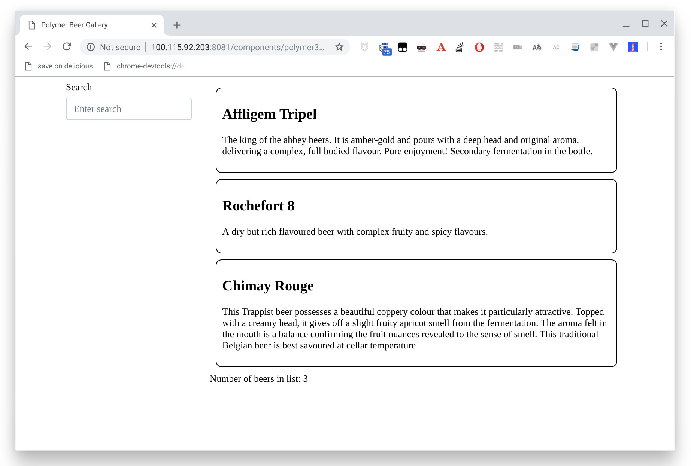
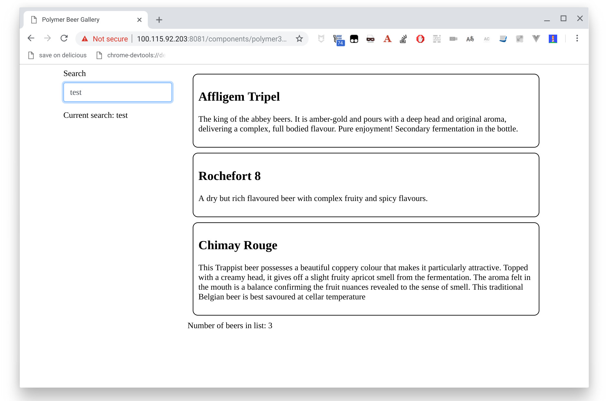
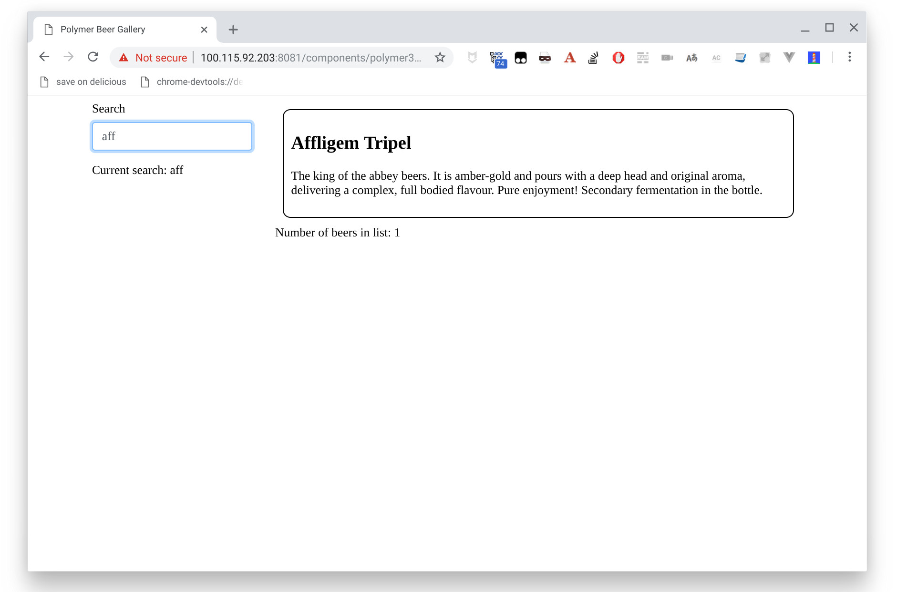

#  LitElement Beers - LitElement tutorial - Step 04

We did a lot of work in laying a foundation for the app in the last step, so now we'll do something simple;
we will add full text search (yes, it will be simple!).

We want to add a search box to the app, and we want the results on the beer list change according to what the user types into the search box.

## Modifying `beer-list` template

We use [Twitter Bootstrap](http://getbootstrap.com) column model to divide the page in two (fully responsive) columns, the left one for the search box, the right one for the beer list.

We need to add a standard HTML `<input>` tag, give them some magical data-binding properties and adding a filter function to process the input for the template rendering.

This lets a user enter search criteria and immediately see the effects of their search on the beer list.  

Let's begin by modifying the template to add the search input.

```js
  render() {
    return html`
      <div class="beers container">
        <div class="row">
          <div class="col-md-3">
            <!--Sidebar content--> 
            <div class="form-group">
              <label 
                  for="search">
                Search
              </label>
              <input 
                  type="text" 
                  class="form-control" 
                  id="search"  
                  placeholder="Enter search">
            </div>
          </div>
          <div class="col-md-9">
            <div class="beers">
              ${
                this.beers.map( (beer) => {
                  return html`
                    <beer-list-item name="${beer.name}" description="${beer.description}">
                    </beer-list-item>
                  `;
                })
              }
            </div>
            <div>Number of beers in list: ${this.beers.length}</div>
          </div>          
        </div>
      </div>
    `;
  }
```




## Two-ways data-binding

Now we need to link the search input field value to a property of the object.

In the template we use `@input` to link the `input` event of the `input` item to an element function that will modify the `filterText` property, and we add a label under it to show the current value of `filterText`:

```js
  static get template() {
    return html`
      ...
      <input 
          type="text" 
          class="form-control" 
          id="search"  
          placeholder="Enter search"
          @input="${this._inputChange}">
      ...
      <div>Current search: ${this.filterText}</div>
      ...
    `;
  }
```

Then we declare the `filterText` property as a string

```js
  static get properties() {
    return {
      beers: {
        type: Array,
      },
      filterText: {
        type: String,
      },
    }
  }
```

And we declare the `_inputChange` function that will be called at every change on the input field. 
Inside it we are using the LitElement `shadowRoot` property to use it as base for our `querySelector()`:


```js
  _inputChange() {
    this.filterText = this.shadowRoot.querySelector('#search').value;
  }
```
And now we have a two-way data-binding between the input field and the label under it.




## Adding a filter to the list

To filter or sort the displayed items in your list, add a [`filter()`](https://developer.mozilla.org/en-US/docs/Web/JavaScript/Reference/Global_Objects/Array/filter) function to the rendering of the beer list:

```js
${
  this.beers
    .filter( (beer) => {
      console.log(beer)
      return beer.name && beer.name.match(new RegExp(this.filterText, 'i'));
    })
    .map( (beer) => {
      return html`
        <beer-list-item name="${beer.name}" description="${beer.description}">
        </beer-list-item>
      `;
    })
}
```              


## Additional experiments

You have maybe noticed it, the *total beers* that you added in the *additional experiments* section some steps ago shows only that, the total. It would be nice if it showed the *current beers* metric, i.e. the number of beers currently showed in page, after filtering.

How could you do it? Instead of using the `beers` property, we can use a function to compute the total number of beers.

In the `render()` method:

```js
<div>Number of beers in list: ${this._currentBeers()}</div>
```

And then: 

```js
_getCurrentBeers() {
  // Do something clever...
},
```

Inside the function we can go through `beers` and incrementing a counter if the beer matches the `beerFilter` filter...





## Summary ##

We have now added full text search! Now let's go on to [step-05](../step-05) to learn how to add sorting capability to the beer app.
