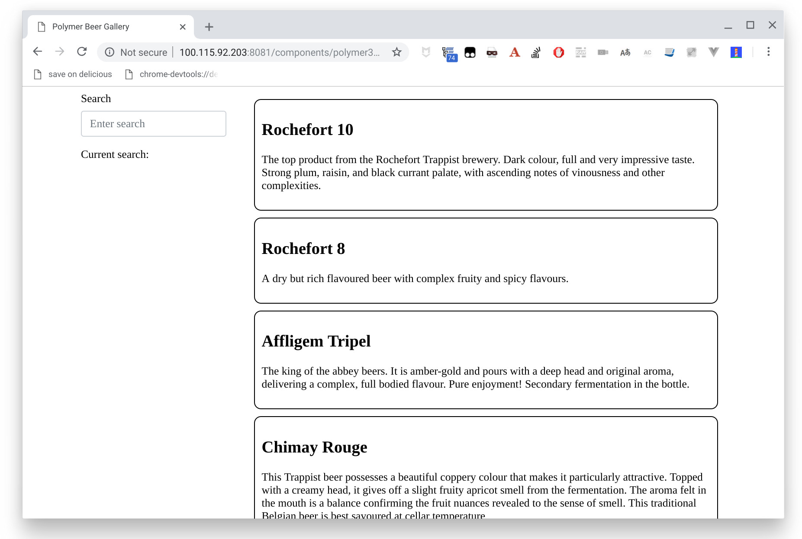
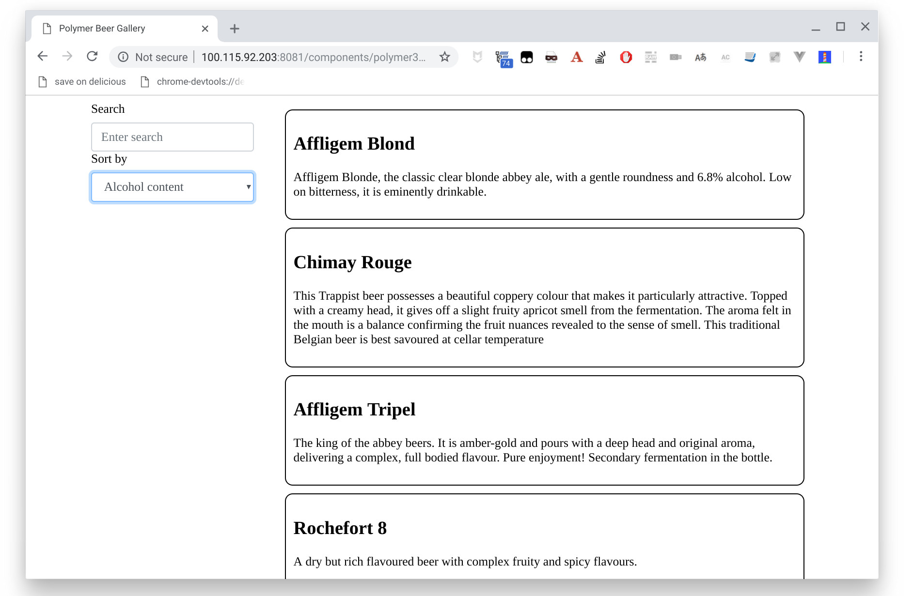

#  LitElement Beers - LitElement tutorial - Step 05

In this step, you will add a feature to let your users control the order of the items in the beer list. The dynamic ordering is implemented by creating a new model property, wiring it together with the repeater, and letting the data binding magic do the rest of the work.

In addition to the search box, the app displays a drop down menu that allows users to control the order in which the beers are listed.

## Adding some more beers

To better see the filtering and sorting capabilities, let's add some more beers to our model:

```javascript
const.beers = [
  {
    "alcohol": 6.8,
    "name": "Affligem Blond",
    "description": "Affligem Blonde, the classic clear blonde abbey ale, with a gentle roundness and 6.8% alcohol. Low on bitterness, it is eminently drinkable."
  },
  {
    "alcohol": 8.5,
    "name": "Affligem Tripel",
    "description": "The king of the abbey beers. It is amber-gold and pours with a deep head and original aroma, delivering a complex, full bodied flavour. Pure enjoyment! Secondary fermentation in the bottle."
  },
  {
    "alcohol": 9.2,
    "name": "Rochefort 8",
    "description": "A dry but rich flavoured beer with complex fruity and spicy flavours."
  },
  {
    "alcohol": 11.3,
    "name": "Rochefort 10",
    "description": "The top product from the Rochefort Trappist brewery. Dark colour, full and very impressive taste. Strong plum, raisin, and black currant palate, with ascending notes of vinousness and other complexities."
  },
  {
    "alcohol": 7,
    "name": "Chimay Rouge",
    "description": "This Trappist beer possesses a beautiful coppery colour that makes it particularly attractive. Topped with a creamy head, it gives off a slight fruity apricot smell from the fermentation. The aroma felt in the mouth is a balance confirming the fruit nuances revealed to the sense of smell. This traditional Belgian beer is best savoured at cellar temperature "
  }
];
```  


## Sorting beers by alcohol content


As we did for the filter, we add a [`sort()`](https://developer.mozilla.org/en-US/docs/Web/JavaScript/Reference/Global_Objects/Array/sort) function to the rendering of the beer list:


```js
${
  this.beers
    .filter( (beer) => {
      return beer.name && beer.name.match(new RegExp(this.filterText, 'i'));
    })
    .sort((a,b) => this._beerSorter(a,b))
    .map( (beer) => {
      return html`
        <beer-list-item name="${beer.name}" description="${beer.description}">
        </beer-list-item>
      `;
    })
}
```

And we define our sorting function:

```javascript
  _beerSorter(a, b) {
    if (a.alcohol === b.alcohol) return 0;
    return b.alcohol - a.alcohol;
  }
```

And it works!



So now we have our beers ordered by alcohol content. But let's do a more flexible order function...


## Selecting order criteria


First, we define a constant with the sorting criteria:

```js
const criteria = [
  { name: "name", label: "Alphabetical"},
  { name: "alcohol", label: "Alcohol content" }
];
```


Then we add a `<select>` html element named `orderProp`, so that our users can pick from the two provided sorting options.

```html
  <div class="form-group">
    <label 
        for="search">
      Search
    </label>
    <input 
        type="text" 
        class="form-control" 
        id="search"  
        placeholder="Enter search"
        @input="${this._inputChange}">
    <label 
        for="sort">
      Sort by
    </label>
    <select 
        id="sort" 
        class="form-control">
      ${ criteria.map( (item) => html`<option value="${item.name}"> ${item.label}</option>`) }
    </select>
  </div>
```

And we add a `criterium` property to the properties:

```javascript
  static get properties() {
    return {
      beers: {
        type: Array,
      },
      filterText: {
        type: String,
      },
      currentBeers: {
        type: String,
        computed: '_getCurrentBeers(beers, filterText)',
      },
      criterium: {
        type: String,
      },
    }
  }
```

And we initialize it in the constructor:

```javascript
  this.criterium = criteria[0].name;
```

Then we modify the sort function to sort according to the chosen property:

```javascript
_beerSorter(a, b) {  
  if ( a[this.criterium] === b[this.criterium] ) return 0;
  if ( a[this.criterium] < b[this.criterium] ) return -1;
  if ( a[this.criterium] > b[this.criterium] ) return 1;      
}
```


Now we need to call a function when the sorting criteria changes. We add an `@change` attribute
to the select:

```html
  <label 
      for="sort">
    Sort by
  </label>
  <select 
      id="sort" 
      class="form-control"
      @change='${this._sortingChanged}'>
    ${ criteria.map( (item) => html`<option value="${item.name}"> ${item.label}</option>`) }
  </select>
```

And the function to deal with it:

```js
  _sortingChanged() {
    this.criterium = this.root.querySelector('#sort').selectedOptions[0].value;
  }
```




## Ascending or descending

By default our sorter sorts in ascending order. Let's add a checkbox to give us descending sort capabilities.

```html
  <label for="descending">Descending sort</label>
  <input 
      id="descending" 
      type="checkbox" 
      @change="${this._descendingChange}">
```

We add a `descendingSort` property:

```javascript
  descendingSort: {
    type: Boolean,
  },
```

And a `_descendingChange` handling function:

```js
  _descendingChange() {
    this.descendingSort = this.shadowRoot.querySelector('#descending').checked;
  }
```

And then we modify the sort to inverse the order if the `descendingSort` property is true:

```javascript
    beerSorter(a, b) {
      var invert = 1;
      if (this.descendingSort) invert = -1;
      if ( a[this.criterium] === b[this.criterium] ) return 0;
      if ( a[this.criterium] < b[this.criterium] ) return -1*invert;
      if ( a[this.criterium] > b[this.criterium] ) return 1*invert;      
    }
```


## Summary ##

Now that you have added list sorting, go to [step 6](../step-06) to learn how to dynamically load our beer data from a server-side JSON file.
